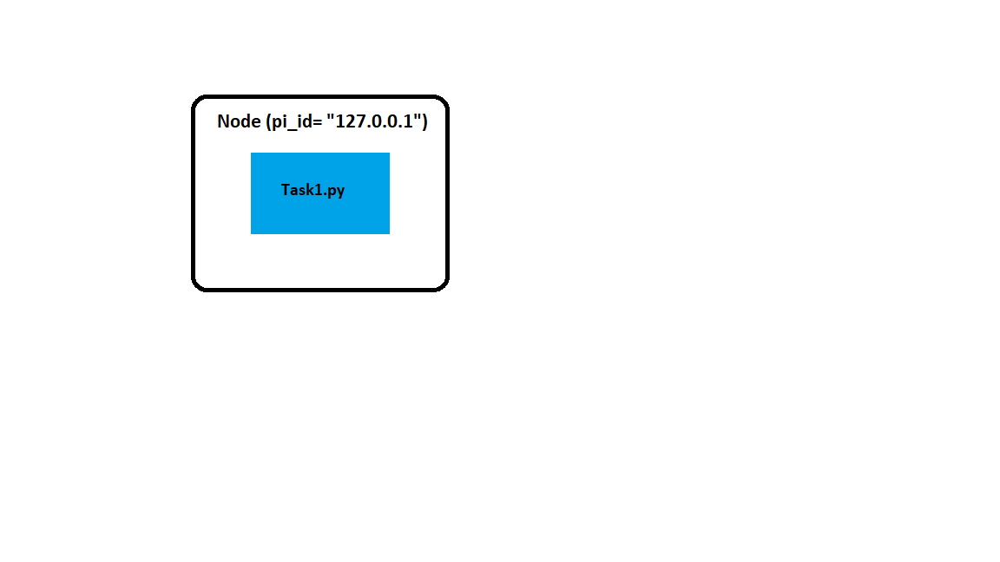
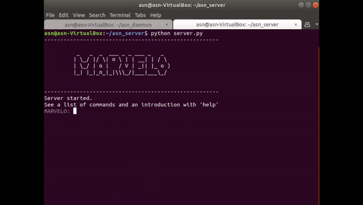

# How to use MARVELO:
------------------------


We go through step by step tutorial on how to use MARVELO by giving examples for different tasks that can be performed with MARVELO-

## Example-1: Print 'Hello World!' on the MARVELO output window.

In this task, we build a simple network with a single node, single block and zero pipes. The MARVELO will read the block and print its output on the MARVELO output window. For the MARVELO to do the network processing, we need to build the network and initiate MARVELO to connect the network and let the nodes communicate with each other.

**Step1: Define the network** 



We write an xml file that describes the distribution of nodes and their respective blocks in the network.

```xml
<network> 
    <node pi_id="127.0.0.1">
	<algorithm path="/home/asn/asn_server/Demos/system/your_folder" executable="./task1.py">                                	
	</algorithm>
    </node> 
</network> 
```

Terminology used in the xml file-

*  `<network>` Open the network
*  `</network>` Close the opened network	
*  `<node` Open the node
* `pi_id="127.0.0.1">` Define the node's IP address
*  `</node>` Close the above opened node
*  `<algorithm` Open the block to be run on the node. Here we define the path, where the block code file is stored on the server and the     name of the block code file is defined with `executable` variable
*  `</algorithm>` Close the block

The xml file is saved in the path `/home/asn/asn_server/Demos/system/topology/your_folder` 

**Step2: Define the block code**- 

MARVELO framework has 2 main roles in the network- server and client. In the above example the server is fed with xml data. The client is the node present in the network. Each client hosts a single Daemon process.The Daemon process receives the orders from the server through **CMD port** to process the block code **task1.py** and executes the block code. It returns the output of the **task1.py** to the server via **MSG port**. This output is printed on the MARVELO output window.

This block code file is saved in the path defined in the xml file.

**Step3: Setup the network**

We can either setup the server and client on the same device or use different devices. Here we use same device for the server and client which is called as Emulator

  1. Navigate to the asn_daemon directory `->` to start the daemon run `sudo python daemon.py - if $logicalInterface` In this example,        our logicalInterface is lo `sudo python daemon.py - if lo`
  2. Navigate to the asn_server directory `->` to start the server run `python server.py` 

**Step4: Start network processing on MARVELO**

Once server is setup, run the below commands on MARVELO-

  1. `setxml` Defines the xml file 
  2. `showxml` It opens a new window and displays the network along with the pipe connections between the blocks
  3. `connect` It establishes initial connection to the nodes defined in the xml file 
  3. `transferdata` Initiates the data transfer to the nodes
  4. `start` It triggers the *Daemon* to start the signal processing by invoking the respective executables (block codes)

Below commands are optional-

  5. `abort` It kills the running modules on the client 
  6. `cleanfolder` It cleans the data stored in the asn_daemon directory on the Client nodes which was transferred by the `transferdata`       command.

**Step5: View output**

Once we run the start command, we can see the **task1.py** output on the MARVELO command window.

**Demo**

 

 [MARVELO-Task1-video](videos/example1_muted.mp4)

**The scripts for the above example can be found here-**
  1. [task1.py](task1.py) 
  2. [task1.xml](task1.xml)

