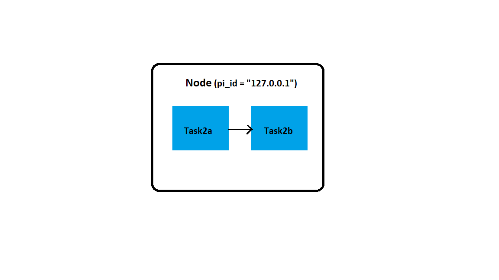
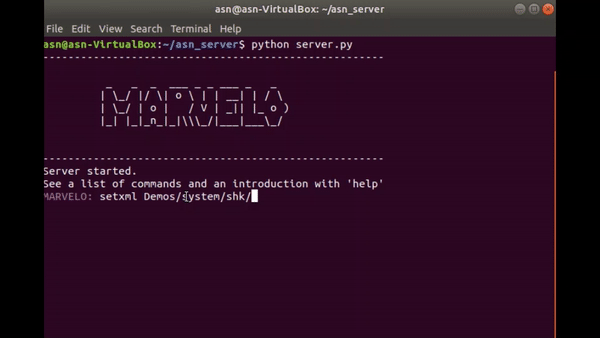

# Example-2: Send an integer or float data to second block and perform an arithmetic operation on the received data in the second block.

In this task, we build a simple network with a single node, two blocks and one pipe connecting the blocks. We send data between the blocks via pipe. Once the data is received by the second block it performs an arithmetic operation on it and prints the output to the MARVELO output window. The network processing in MARVELO takes place in the following steps-

## Step1: Define the network 




We write an xml file that describes the distribution of nodes and their respective blocks in the network.

```xml
<network>
    <node pi_id="127.0.0.1">
       <algorithm path="/home/asn/asn_server/Demos/system/topology/your_folder" executable="./task2a.py">   
	   <output target_pi_id = "127.0.0.1" pipe_id="1"></output>                            	
       </algorithm>
       <algorithm path="/home/asn/asn_server/Demos/system/topology/your_folder" executable="./task2b.py">
	   <input source_pi_id = "127.0.0.1" pipe_id="1"></input>                                	
       </algorithm>
    </node>
</network>
```

New terminology used in this xml file-

* `<output>` Open the output pipe.
  * define the output node address and the `pipe_id` that connects this block to the block defined in the output node. 
  * In the above xml code the output of `task2a.py`  is sent to `task2b.py` block. Hence the `target_pi_id` is the address of the node where `task2b.py` is hosted.
* `</output>` Close the output pipe.
* `<input>` Open the input pipe.
  * define the input node address and the `pipe_id` that connects this block to the block defined in the input node.
  * In the above xml code the `task2b.py` gets input from `task2a.py`.  Hence the `source_pi_id` is the address of the node where `task2a.py` is hosted
*  `</input>` Close the input pipe.

The xml file is saved in the path `/home/asn/asn_server/Demos/system/topology/your_folder`


## Step2: Define the block codes


**1. task2a.py**

  1. In this block code, we define the data that is sent to the second block code.
  * We declare the output port in the parse arguments() function, which was defined in the xml file  as `<output>`.
  * The argparse module parses the arguments of the command line out of sys.argv into Python datatype 
  * In our example, `task2a.py` reads the 'output' argument from the command line(in xml file), this output argument is provided by the MARVELO to the Daemon process running on client.

     ```python 
    def parse_arguments():
          parser=argparse.ArgumentParser(description='arguments')  
          parser.add_argument("--outputs", "-o", action="append")  
	  return parser.parse_args()
    args = parse_arguments() 
    ```

   5. The add_argument method in ArgumentParser function creates a list of pipe files of **int** data type and appends each `<output>` argument from the xml file to the `--outputs` list . Since there is only one output pipe defined in the xml file, there will be only one pipe file appended to the `--outputs` list. 

       ```python
       outputs = [os.fdopen(int(args.outputs[0]), 'wb')]
       outputs[0].write(y)
       ```
   2. The `--outputs` list can be queried as `args.outputs[0]`. Here `args.output[0]` refers to the first pipe file which is defined as `pipe_id = "1"` in the xml file, appended in the 
      `--outputs` list. 
   3. The data to be sent to the second block is written to this pipe file. We open a write enabled file object of `args.outputs[0]` using `os.fdopen(int(args.outputs[0]),'wb')` function and           later the int data is written to the pipe through the `write` method.


**2. task2b.py** 

  1. In this block code, we define the arithmetic operation that is to be performed on the data received from `task2a.py`
  2. We declare the input port in the parse arguments() function, which was defined in the xml file        as `<input>`.
  * The argparse module parses the arguments of the command line out of sys.argv into Python datatype 
  * In our example, `task2b.py` reads the `input` argument from the command line(in xml file), this       input argument is provided by the MARVELO to the Daemon process running on client.
  * The add_argument method in ArgumentParser function creates a list of pipe files of int data type     and appends each `<input>` argument from the xml file to the `--inputs` list . Since there is         only one input pipe defined in the xml file, there will be only one pipe file appended to the 
    `--inputs` list. 

    ```python
     inputs = [os.fdopen(int(args.inputs[0]), 'rb')]
     inputs[0].readline()
    ```
  2. The `--inputs` list can be queried as `args.inputs[0]`. Here `args.input[0]` refers to the first pipe file which is defined as `pipe_id = "1"` in the xml file, appended in the `--inputs` list. 
  3. The data to be from the first block is read from this pipe file. We open a read enabled file object of `args.inputs[0]` using `os.fdopen(int(args.inputs[0]),'rb')` function and later the int data is read from the pipe through the `readline()` method.


# Step3: 

We repeat the steps Step3 to Step5 as in [Example1](Example1.md) .

The script for the above example can be found here-

  1.[task2.xml](task2.xml)

  2.[task2a.py](task2a.py)

  3.[task2b.py](task2b.py)

# Demo:

[MARVELO-Task2](gif/video-to-gif-3.gif)



[MARVELO-Task2-video](videos/example2_muted.mp4)


