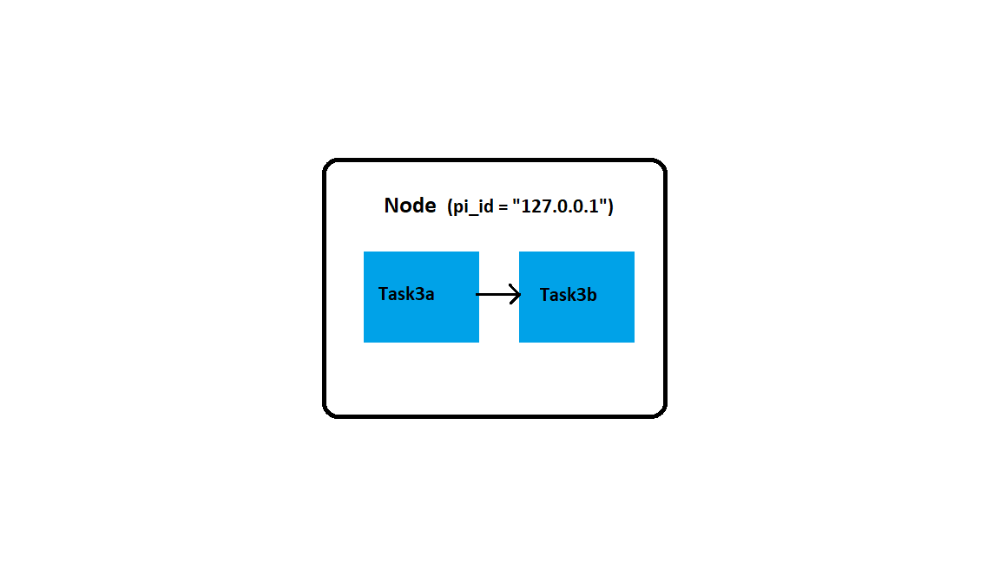
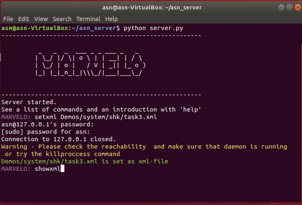

# Example-3: Send a single array to the second block and perform an arithmetic operation on the received data in second block

In this task, we build a simple network with a single node, two blocks and one pipe connecting the blocks. We send data between the blocks via pipe. Once the data is received by the second block it performs an arithmetic operation on it and prints the output to the MARVELO output window. The network processing in MARVELO takes place in the following steps-


## Step1: Define the network



We write an xml file that describes the distribution of nodes and their respective blocks in the network.
The same xml file described in Example1 can be used here.

## Step2: Define the block codes

**1. task3a.py**

  1. In this block code, we define the data that is sent to the second block code.

  2.  argparse module is used to create the pipe file needed to send the data to the second block.
  
  3.  We define the array y of float data type
  
      ```python
      y = np.array([2.0,3,4,5,6],dtype=np.float16)
      outputs = [os.fdopen(int(args.outputs[0]), 'wb')]
      outputs[0].write(y)
      ```
   
  4. The array is written to this pipe file using the `write` method.

**2. task3b.py** 

  1. In this block code, we define the arithmetic operation that is to be performed on the data received from `task3a.py`

  2. argparse module is used to create the pipe file needed to get the data from the first block. 

  3. In our example, `task3b.py` reads the `input` argument from the command line(in xml file), this input argument is provided by the        MARVELO to the Daemon process running on client.

  4. The add_argument method in ArgumentParser function appends each `<input>` argument from the xml file to the `--inputs` list . 
     
      ```python
      inputs = [os.fdopen(int(args.inputs[0]), 'rb')]
      x =  np.fromfile(inputs[0],dtype=np.float16,count=5)
      ```
    
  5. Once the pipe file inputs[0] is read enabled, the array data is read from the pipe and stored in x variable. We make use of the `np.fromfile` function to read the data from the file. The `count` parameter defines the size of the data that should be read at once from the pipe. In our input array each element is of size 16 byte as the data type that we are using `float16`. So the total size of array is 80 bytes, hence we define `count = 5`, which implies we read 80 bytes of data at once.

  3. The input array is saved in the variable y. Later we perform `np.mean` operation on this array, which calculates the mean value for the values in array. This is printed to the MARVELO output window.


# Step3: 

We repeat the steps Step3 to Step5 as in [Example1](Example1.md) .

**The scripts for the above example can be found here-**

  1. [task3.xml](task3.xml)
  
  2. [task3a.py](task3a.py)
  
  3. [task3b.py](task3b.py)


# Demo:

[MARVELO-Task3](gif/video-to-gif-1.gif)



[MARVELO-Task3-video](videos/Media3_muted.mp4)


