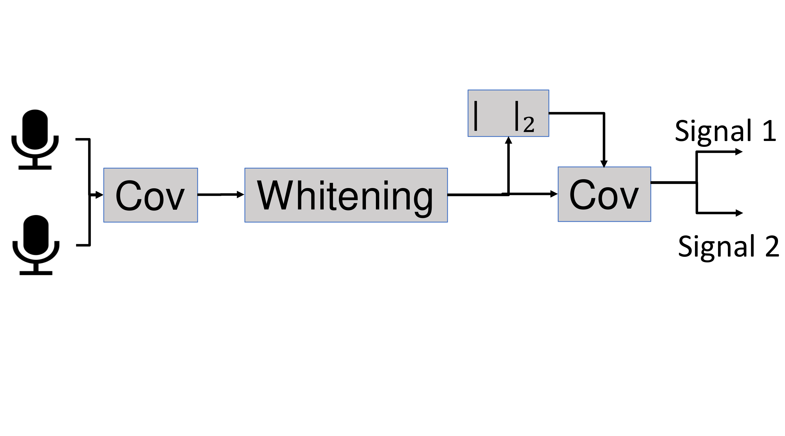
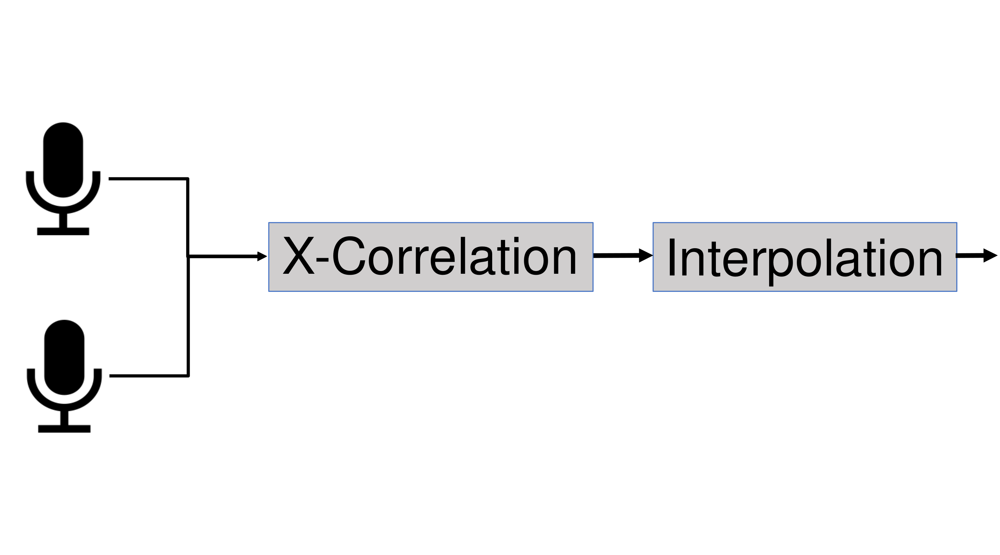

# Acoustic Signal Processing

## Source Separation
Consider the following scenario. There are *P* independent speakers possibly speaking in the same room at the same time. In that room there are *P* independent microphones collecting mixed audio signals *X*. The goal is to seperate *X* to estimate the source audio signals *s_p*.
There  are  a  three  assumptions  that we  consider  when  separating  the  signals  using  Independent Component  Analysis  (ICA) [1] :  First,  mixed  signals  are  alinear combination of the original signals. Second, the sourcesignals  are  independent.  Third,  the  source  signals  are  not Gaussian.
This  can  be  divided  into  4  different  tasks: Cov1, Whitenning, norm and Cov2. The overlay graph can be seen in the following figure.

The current implementation uses instead of microphone wav-files to get the acoustic signals.
Our implementation also measures the network delay, CPU utilization, etc, using [**LoggingJob**](../example_networks/shared.jobs) and [**LoggingSinkJob**](../example_networks/shared.jobs).

For more information on the implementation, take a look at the [documentation](../example_networks/demo_source_separation).

## Synchronization
In WASN, the microphones have their own sampling clock, however,  missynchronization  between  microphones  will  de-grade  the  performance  of  acoustic  applications.  We  consider Double-cross-Correlation Processor (DXCP) [2] for estimating  the  sampling  rate  offset  between  different  microphones, which can then be used to adjust the sampling clock [3] or to compensate  for  their  missynchronization  in  further  acousticprocessing.  DXCP  applies  only  under  the  assumption  that sampling rate offset is time-invariant.The DXCP application can be divided into two main tasks:  cross-correlation  function  and  parabolic  interpolation.  The  former  is  used  to  estimate  the  accumulated  time delay  between  two  (time-framed)  signals.  The  output  is  then forwarded  to  the  latter  that  uses  a  second-order  polynomial interpolation to find the maximum lag and estimate the sampling rate offset. The overlay graph can be seen in the following figure.

The current implementation uses instead of microphone wav-files to get the acoustic signals.
Our implementation also measures the network delay, CPU utilization, etc, using [**LoggingJob**](../example_networks/shared.jobs) and [**LoggingSinkJob**](../example_networks/shared.jobs).

For more information on the implementation, take a look at the [documentation](../example_networks/demo_DXCP).

## Literature
- [1]: J. Cardoso,  “Source  separation  using  higher  order  moments,”  in *International Conference on Acoustics, Speech, and Signal Processing*, 1989, pp. 2109–2112 vol.4.
- [2]: A. Chinaev, P.Thüne, and G. Enzner, “A double-cross-correlationprocessor for blind sampling rate offset estimation in acoustic sensornetworks,” in *Proc. IEEE Int. Conf. Acoust., Speech, Signal Process.*, May 2019, pp. 641–645.
- [3]: A. H., S. J., U. J., H.-U. R., and K. H.,  “MARVELO – a  framework for signal processing in wireless acoustic sensor networks,” *13th ITG conference on Speech Communication*, October 2018.
